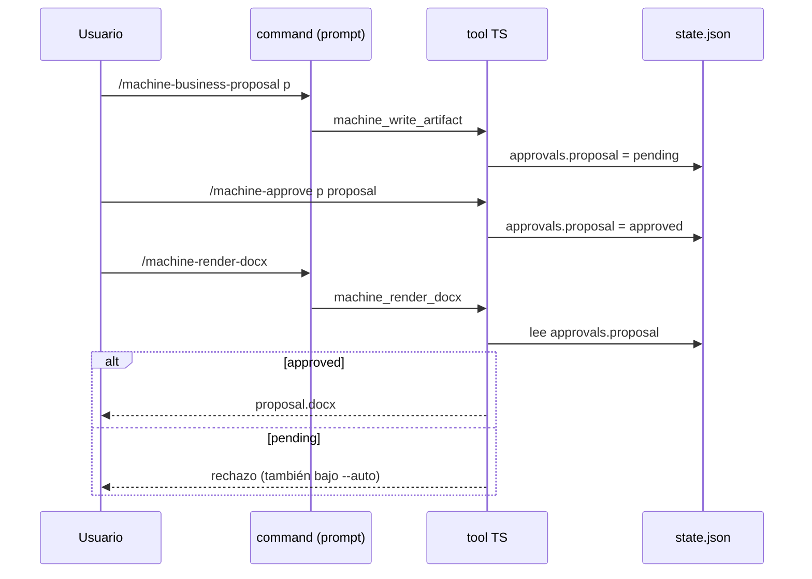
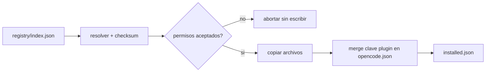

# Design: The AI Machine público para Opencode

Alcance: fases 1–3 (marketplace mínimo, `machine-core`, `machine-business`).

## Enfoque técnico

Cada paquete es **dos cosas a la vez**, porque la API de Opencode v1 obliga a separarlas:

1. **Contenido portable** — `commands/*.md`, `agents/*.md`, `skills/*/SKILL.md`, `templates/`. Son archivos; el instalador los copia a `~/.config/opencode/` o `.opencode/`.
2. **Plugin npm** — módulo TS que exporta `tool: { ... }` con la lógica determinista. Se declara en la clave `plugin` de `opencode.json`.

Esa separación no es preferencia: en v1 un paquete npm **sólo** aporta hooks y tools, y los commands/agents/skills **sólo** existen como archivos. Ningún mecanismo cubre ambos, de ahí el instalador propio.

La regla que ordena todo el diseño: **los commands markdown son prompts, no código**. Todo lo que la spec marca MUST verificable —hash, puertas, dependencias— vive en tools TS. El prompt sólo invoca el tool.

## Decisiones de arquitectura

| # | Decisión | Alternativa descartada | Justificación (contrastada con la API real) |
|---|---|---|---|
| D1 | Contenido como archivos + instalador CLI propio | Paquete npm en clave `plugin` | En v1 `plugin` no registra commands/agents/skills. `ctx.command.transform` existe sólo en v2 beta |
| D2 | Lógica crítica en custom tools TS (`tool:` del plugin) | Instrucciones en el prompt del command | Un prompt no garantiza idempotencia ni bloqueo; el modelo puede ignorarlo. El tool es código |
| D3 | Estado en `docs/<proyecto>/.machine/state.json` | Sesión de Opencode (`--continue`) | Cada `opencode run` puede ser sesión nueva. El filesystem ya es el entregable |
| D4 | Puerta = estado persistido verificado por tool | `permission: ask` sobre `edit`/`bash` | `opencode run --auto` auto-aprueba todo permiso no denegado; la puerta se saltaría |
| D5 | Instalador hace **merge** de la clave `plugin` en `opencode.json` | Pedir edición manual al usuario | Los orígenes de config se mergean, no se reemplazan; el instalador debe preservar claves ajenas |
| D6 | Agente con `permission: { bash: deny }` para **todo** command que invoque un tool protegido, incluidos los compartidos de `machine-core` | Confiar en que el modelo use el tool; usar el agente `build` por defecto | Cierra el rodeo de D2: sin bash, el render sólo es alcanzable por el tool. `build` trae bash permitido, así que apuntar ahí reabre el rodeo |
| D7 | Skills publicadas también a `.claude/skills/` | Sólo `.opencode/skills/` | Opencode lee `.claude/skills/` sin cambios; el mismo paquete sirve a dos runtimes |
| D8 | pnpm workspaces; uv si aparece Python | npm / bun install | Decisión del proyecto. Los paquetes publicados siguen siendo instalables por Bun, que es lo que usa Opencode en el consumidor |

## Flujo de la puerta humana



## Flujo de instalación



## Archivos

| Ruta | Acción | Descripción |
|---|---|---|
| `pnpm-workspace.yaml` | Crear | Workspaces del monorepo |
| `registry/schema.json` | Crear | Schema de `machine.json` y del catálogo |
| `registry/index.json` | Generar | Catálogo público; nunca a mano |
| `tools/build-registry/` | Crear | Genera y valida el catálogo; falla ante colisión de comandos |
| `cli/src/{install,list,search,info,update,uninstall}.ts` | Crear | Instalador; escribe `installed.json` |
| `cli/src/opencode-config.ts` | Crear | Merge no destructivo de `opencode.json` |
| `packages/machine-core/src/{state,hash,approvals,deps}.ts` | Crear | Núcleo determinista |
| `packages/machine-core/src/index.ts` | Crear | Plugin v1: expone los tools |
| `packages/machine-core/commands/machine-{process-input,render-docx,approve}.md` | Crear | Comandos compartidos |
| `packages/machine-core/agents/machine.md` | Crear | `mode: subagent`, `bash: deny`; los commands compartidos MUST apuntar aquí, no a `build` |
| `packages/machine-core/templates/` | Crear | Plantilla DOCX (**NEEDS INPUT**) |
| `packages/machine-business/src/{init,proposal,index}.ts` | Crear | Lógica de fase 0; consume los tools de `machine-core`, no los reimplementa |
| `packages/machine-business/commands/machine-business-{init,proposal}.md` | Crear | Fase 0 |
| `packages/machine-business/agents/machine-business.md` | Crear | `mode: subagent`, `bash: deny` |
| `packages/*/machine.json` | Crear | Manifiestos |

## Contratos

```ts
type Gate = "pending" | "approved" | "rejected"

type MachineState = {
  phase: string
  inputs: { path: string; sha256: string; processedAt: string; route: "business" | "discovery"; outputPath: string }[]
  approvals: Record<string, { status: Gate; at?: string; dependsOn?: string[] }>
}

type InstalledEntry = {
  id: string; version: string; target: "global" | "project" | "claude"
  files: { path: string; sha256: string }[]
}
```

Los tools se nombran `machine_*` (snake_case) para no colisionar con los built-in de Opencode.

## Testing

| Capa | Qué | Cómo |
|---|---|---|
| Unit | hash, transiciones de gate, invalidación aguas abajo, merge de `opencode.json` | `pnpm test`, sin FS real salvo tmp |
| Integration | install → update → uninstall; restauración ante fallo | Directorio temporal como HOME simulado |
| E2E | pipeline business completo hasta rechazo por gate | `opencode run --auto`; el rechazo es el aserto clave |
| Contrato | validación de todos los `machine.json` y del catálogo | En CI, con pnpm y con Bun |

## Límites conocidos de la garantía

### 1. La síntesis no es determinista

`machine_business_proposal` recibe las secciones ya redactadas y verifica sólo lo verificable:
que existan insumos `route: business`, que una sección vacía se marque `NEEDS INPUT`, y que la
puerta quede en `pending`. Es la división correcta según D2 —redactar no es una operación
determinista— pero tiene una consecuencia que no se MUST ocultar:

**el requisito "MUST NOT inventarse contenido no derivable de los insumos" no está garantizado
por código.** Si el modelo redacta una sección plausible sin respaldo en los insumos y la pasa
al tool, el tool la escribe. La defensa es el prompt del agente `machine-business`, que es
mitigación, no garantía.

Cerrarlo del todo exigiría que el tool verificase la trazabilidad de cada afirmación hasta un
insumo concreto —atribución a nivel de frase—, que es un problema abierto. Alternativa parcial
a evaluar: exigir que cada sección declare qué `inputs[].path` la respaldan, y que el tool
rechace una sección sin atribución. No implementado.

La puerta humana es lo que hoy cubre este hueco: alguien lee la propuesta antes de aprobarla.
Ese es el motivo real por el que la puerta no es opcional.

### 2. El rodeo por shell


D4 y D6 garantizan que **el pipeline** no produce un entregable sin aprobación: los tools
`machine_*` son la única ruta que el flujo de commands ofrece, y el agente `machine` deniega
`bash` y `edit` para que no exista otra.

Lo que NO garantizan: que un usuario, desde su propio agente primario con `bash: allow`,
invoque Pandoc por su cuenta al margen del pipeline. Nada en la plataforma lo impide, y no es
un hueco que un paquete pueda cerrar — el modelo de confianza de Opencode deja el shell en
manos del agente que el usuario elige.

La lectura correcta es que la puerta es una garantía **del producto**, no un control de
seguridad frente a un usuario que decide saltárselo deliberadamente. Para el caso de uso real
—evitar que una ejecución no interactiva emita un entregable sin revisión humana— es
suficiente. No lo es para un modelo de amenaza con usuario hostil, y no se MUST presentar como tal.

## Migración

No aplica: greenfield. El rollout es por fases 1→2→3; `machine-business` no se publica hasta que `machine-core` esté verde.

## Preguntas abiertas

- [x] ~~Plantilla corporativa DOCX no disponible~~ → existe `templates/reference.docx`, plantilla **base neutra** generada por `tools/build-template/`. El render ya no está bloqueado.
- [ ] **Identidad corporativa real** (`NEEDS INPUT`): la plantilla actual no lleva marca. Sustituirla sigue pendiente de insumo externo.
- [x] ~~Validación con Pandoc~~ **CERRADO (Pandoc 3.10.2)**: renderizado real con `--reference-doc` en exit 0, y verificada la herencia efectiva de estilos — los 5 colores y las 2 tipografías de la plantilla aparecen en el `.docx` de salida, los `pStyle` emitidos corresponden a estilos de la plantilla y los 20 `styleId` están presentes. No basta con que Pandoc no falle: un `styleId` mal nombrado se ignora en silencio, así que la comprobación válida es la herencia, no el exit code.
- [ ] **Generación no determinista de `reference.docx`**: regenerar produce un binario distinto a nivel de bytes (timestamps del ZIP) con contenido equivalente. Fijar timestamps en `build-template.py` haría el build reproducible y los diffs binarios significativos.
- [ ] Formato exacto de `business/proposal.md` (secciones, profundidad) no derivable del insumo.
- [ ] ¿El instalador debe escribir `opencode.json` del proyecto o del usuario cuando ambos existen? Propuesta: el que corresponda al `target` elegido.
- [ ] Verificar en implementación que un agente con `bash: deny` no puede eludirse vía otro agente primario del usuario.
